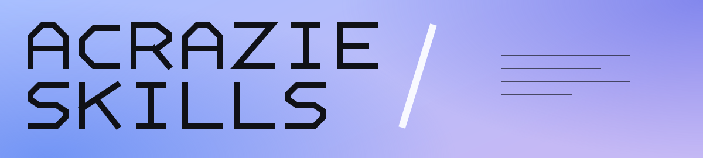

<p align="center">
  
</p>

<p align="center">
  <a href="https://github.com/Acrazie">GitHub</a> &nbsp;·&nbsp; <a href="https://www.linkedin.com/in/mayeuld/">LinkedIn</a> &nbsp;·&nbsp; <a href="https://www.skills.sh/acrazie/skills">Agent Skills</a>
</p>

<p align="center">Building skills for coding agents.</p>

<h2 align="center">Agentic Harnesses</h2>

<p align="center">
   <strong>Claude Code</strong> &nbsp;&nbsp;
   <strong>Codex</strong> &nbsp;&nbsp;
   <strong>Hermes</strong> &nbsp;&nbsp;
   <strong>Anti-Gravity</strong>
</p>

## Agent Skills Ecosystem

<p>
  
</p>

### [SVG Icon Designer](https://www.skills.sh/acrazie/skills/svg-icon-designer-acrazie)

Original SVG logos and icons, developed through focused concept iterations.

### [Skill Refiner](https://www.skills.sh/acrazie/skills/skill-refiner-acrazie)

Structured testing feedback, refinement logs and decision records.

### [Audit Repository](https://www.skills.sh/acrazie/skills/audit-repository-acrazie)

Technical decisions examined against evidence from the repository.

[Explore the collection on skills.sh →](https://www.skills.sh/acrazie/skills)

```bash
npx skills add acrazie/skills
```

## Engineering Stack

**Frontend** &nbsp; React · TypeScript · JavaScript · SCSS · Tailwind CSS

**Backend** &nbsp; Python · Symfony · Node.js · PostgreSQL
