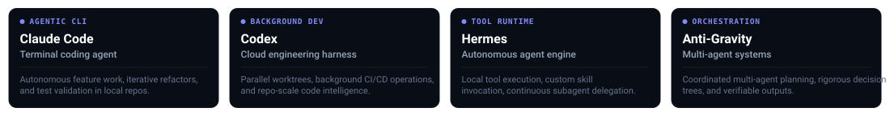
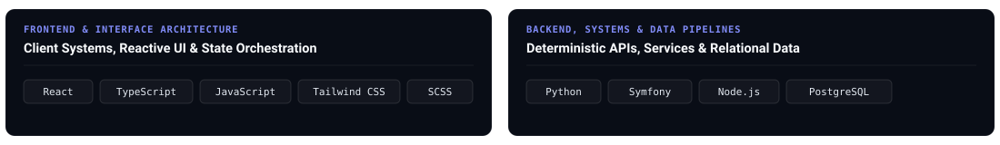

<div align="center">
  
</div>

<p align="center">
  <a href="https://github.com/Acrazie" target="_blank">
    
  </a>
  &nbsp;
  <a href="https://www.linkedin.com/in/mayeuld/" target="_blank">
    
  </a>
  &nbsp;
  <a href="https://www.skills.sh/acrazie/skills" target="_blank">
    
  </a>
</p>


### Overview

Software Engineer &amp; AI Engineer focused on autonomous agent runtimes, deterministic evaluation frameworks, and high-performance fullstack systems. Building production-grade skills and harnesses for next-generation coding agents.


<sub>RUNTIMES &amp; WORKSPACES</sub>
## Agentic Harnesses




<sub>FOUNDATIONAL SYSTEMS</sub>
## Engineering Stack




<sub>AUTONOMOUS CAPABILITIES</sub>
## Agent Skills Ecosystem

Catalog of verified skills authored for autonomous coding agents, published on the global registry at [**skills.sh/acrazie/skills**](https://www.skills.sh/acrazie/skills).

| Skill | Focus | Implementation |
| :--- | :--- | :--- |
| **`svg-icon-designer-acrazie`** | Autonomous SVG Logo &amp; Icon Synthesis | Modular geometric glyph construction with strict vector constraints |
| **`skill-refiner-acrazie`** | Skill Refinement &amp; Testing Harness | Empirical testing loop, telemetry logging &amp; ADR documentation |
| **`audit-repository-acrazie`** | Deep Repository &amp; Architecture Audit | Structured decision tree inspecting stacks, dependencies &amp; technical health |

```bash
# Add the complete Acrazie skills suite
$ npx skills add acrazie/skills

# Or install individual skills directly
$ npx skills add acrazie/audit-repository-acrazie
$ npx skills add acrazie/skill-refiner-acrazie
$ npx skills add acrazie/svg-icon-designer-acrazie
```


<sub>ACTIVITY MATRIX</sub>
## Telemetry

<div align="center">
  <picture>
    <source media="(prefers-color-scheme: dark)" srcset="https://raw.githubusercontent.com/Acrazie/Acrazie/output/github-snake-dark.svg" />
    <source media="(prefers-color-scheme: light)" srcset="https://raw.githubusercontent.com/Acrazie/Acrazie/output/github-snake.svg" />
    
  </picture>
</div>

<br>

<div align="center">
  <sub><code>const systems = { focus: "deterministic agents", architecture: "resilient code", status: "always building" };</code></sub>
</div>
