  <picture>
    <source media="(prefers-color-scheme: dark)" srcset="./assets/hero-dark.svg">
    <source media="(prefers-color-scheme: light)" srcset="./assets/hero-light.svg">
    
  </picture>

  
  &nbsp;
  
  &nbsp;
  

---

### `// 01. ABOUT`

> *Étudiant en Pré-Master of Science (Pre-MSC) à **Epitech**, passionné par la conception d'interfaces modernes, les architectures fullstack robustes et l'ingénierie logicielle agentique.*

- 🔭 **Focus principal** : Développement d'applications web réactives avec **Next.js**, **React**, et **TypeScript**.
- 📐 **Sens du détail & UI** : Attrait particulier pour le design sobre, le minimalisme néo-grotesque et les interactions cinétiques.
- ⚡ **Outdoor & Passions** : Surf, escalade de bloc et randonnée.

---

### `// 02. STACK & ECOSYSTEM`

<table>
  <tr>
    <td width="33%" valign="top">
      <h4>🌐 Frontend & Creative</h4>
      

        
         
        
         
        
        
      

    </td>
    <td width="33%" valign="top">
      <h4>⚙️ Backend & Data</h4>
      

        
         
        
         
        
        
      

    </td>
    <td width="33%" valign="top">
      <h4>🛠 Systems & Tooling</h4>
      

        
         
        
         
        
        
      

    </td>
  </tr>
</table>

---

### `// 03. CONTRIBUTION TELEMETRY`

  <picture>
    <source media="(prefers-color-scheme: dark)" srcset="https://raw.githubusercontent.com/Acrazie/Acrazie/output/github-snake-dark.svg" />
    <source media="(prefers-color-scheme: light)" srcset="https://raw.githubusercontent.com/Acrazie/Acrazie/output/github-snake.svg" />
    
  </picture>

 

  <code>const dev = { focus: "clean code", design: "minimalist", status: "always building" };</code>

