<p align="center">
  
</p>

<p align="center">
  <a href="https://github.com/Acrazie" target="_blank" rel="noopener noreferrer"><picture><source media="(prefers-color-scheme: dark)" srcset="./assets/github-dark.svg"></picture></a>
  &nbsp;&nbsp;&nbsp;&nbsp;
  <a href="https://www.linkedin.com/in/mayeuld/" target="_blank" rel="noopener noreferrer"></a>
  &nbsp;&nbsp;&nbsp;&nbsp;
  <a href="https://www.skills.sh/acrazie/skills" target="_blank" rel="noopener noreferrer"></a>
</p>

<p align="center">Building skills for coding agents.</p>

<h2 align="center">Agentic Harnesses</h2>

<table align="center">
  <tr>
    <td align="center" width="130">
      <br>
      <sub><b>Claude Code</b></sub>
    </td>
    <td align="center" width="130">
      <br>
      <sub><b>Codex</b></sub>
    </td>
    <td align="center" width="130">
      <br>
      <sub><b>Hermes</b></sub>
    </td>
    <td align="center" width="130">
      <br>
      <sub><b>Anti-Gravity</b></sub>
    </td>
  </tr>
</table>

## Agent Skills Ecosystem

<p align="center">
  <picture>
    <source media="(prefers-color-scheme: dark)" srcset="./assets/acrazie-skills-dark.svg">
    
  </picture>
</p>

### [SVG Icon Designer](https://www.skills.sh/acrazie/skills/svg-icon-designer-acrazie)

Original SVG logos and icons, developed through focused concept iterations.

### [Skill Refiner](https://www.skills.sh/acrazie/skills/skill-refiner-acrazie)

Structured testing feedback, refinement logs and decision records.

### [Audit Repository](https://www.skills.sh/acrazie/skills/audit-repository-acrazie)

Technical decisions examined against evidence from the repository.

[Explore the collection on skills.sh →](https://www.skills.sh/acrazie/skills)

```bash
npx skills add acrazie/skills
```

<p align="center">
  
</p>
